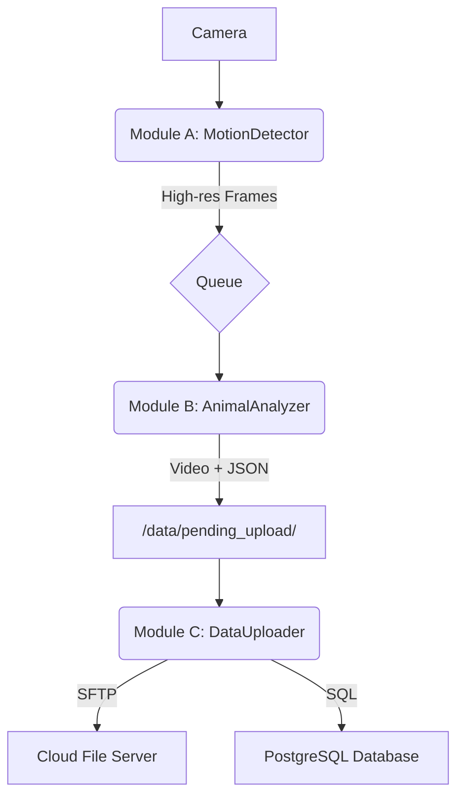

# BioCoder-Edge

An intelligent, field-deployable animal monitoring system. BioCoder-Edge uses a multi-stage AI pipeline to efficiently detect animal activity, capture high-quality video, and reliably upload significant events to a central database for scientific research.

## Overview

This repository contains the source code for the edge device component of the BioCoder project. The system is designed to run on a power-constrained device (like a Jetson Nano Orin) deployed in the wild. It employs a three-module architecture to maximize efficiency and reliability:

1.  **Motion Detection:** A lightweight, low-power process continuously monitors a low-resolution video stream for any motion.
2.  **Animal Analysis:** When motion is detected, high-resolution frames are passed to a more powerful YOLO-based model to identify specific animal species.
3.  **Data Upload:** If an animal of interest is confirmed, the event (video and metadata) is packaged and handed to a resilient uploader that sends the data to a cloud server.

This approach ensures that the power-hungry GPU and network components are only activated when there is a high probability of a significant biological event, dramatically extending battery life.

## Key Features

-   **Efficient Motion Detection:** Uses adaptive background subtraction to filter out environmental noise like wind and changing shadows.
-   **AI-Powered Species Identification:** Employs a YOLO model to analyze motion events and confirm the presence of target animal species.
-   **Robust Data Packaging:** Confirmed events are saved as a pair: a high-quality MP4 video and a detailed JSON metadata file.
-   **Resilient Data Upload:** A background process reliably uploads data to a remote server using SFTP and records metadata in a PostgreSQL database, automatically retrying on network failure.
-   **Modular Architecture:** The system is built with three independent processes that communicate safely, ensuring stability and responsiveness.

## Live View Feature (Optional)

The system includes an optional, on-demand live viewing feature. To use it, you must first set `enabled: true` in the `live_view` section of your `config.yaml`.

The main `biocoder-edge` application must be running for this feature to work.

### Local Viewing (On the Jetson Desktop)

This is useful for direct debugging. It reads the camera feed from the RAM disk.

1.  Start the main application in one terminal: `python main.py`
2.  Open a second terminal and run:
    ```sh
    python scripts/view_live_local.py
    ```
    A window will appear showing the live feed. Press 'q' to close it.

### Remote Viewing (Over the Network)

This runs a web server that streams the feed, allowing you to view it from a web browser on another computer.

1.  Start the main application in one terminal: `python main.py`
2.  Open a second terminal and run the stream server:
    ```sh
    python scripts/stream_server.py
    ```
3.  On any computer on the same network, open a web browser and navigate to `http://<JETSON_IP_ADDRESS>:8080`. For remote access from outside the local network, see documentation on setting up a VPN or a reverse SSH tunnel.

## System Architecture

The application operates as a pipeline of three independent modules communicating through a data queue and the local filesystem.



## Getting Started

Follow these instructions to get a copy of the project up and running on your local machine for development and testing.

### Prerequisites

-   Python 3.8 or higher
-   An NVIDIA Jetson device (or a Linux PC with a CUDA-enabled GPU)
-   A connected camera (USB webcam or CSI camera)
-   `ffmpeg` installed (`sudo apt-get install ffmpeg`)
-   Access to a remote server with PostgreSQL and an SFTP user

### Installation

1.  **Clone the repository:**
    ```sh
    git clone https://github.com/your-username/biocoder-edge.git
    cd biocoder-edge
    ```

2.  **Create and activate a Python virtual environment (recommended):**
    ```sh
    python3 -m venv venv
    source venv/bin/activate
    ```

3.  **Install the required dependencies:**
    ```sh
    pip install -r requirements.txt
    ```

4.  **Configure the application:**
    The system is configured using a single YAML file.
    -   Copy the template: `cp config/config.yaml.template config/config.yaml` (You will need to create the `config.yaml.template` file first).
    -   Edit `config/config.yaml` and fill in all the necessary parameters, especially the `animal_analyzer` and `uploader` sections with your model paths, server IP addresses, credentials, and paths.

## Usage

To run the entire application, execute the main script from the root directory:

```sh
python main.py
```

The application will start all three modules. You will see log messages in your terminal indicating the status of each module. To stop the application gracefully, press `Ctrl+C`.

## Project Structure

-   **`main.py`**: The main entry point that initializes and runs all modules.
-   **`config/`**: Contains the `config.yaml` file for all system settings.
-   **`src/`**: Contains the core source code for the application.
    -   `motion_detector/`: Module A for detecting motion.
    -   `animal_analyzer/`: Module B for YOLO analysis and data packaging.
    -   `data_uploader/`: Module C for handling cloud uploads.
-   **`data/`**: Default location for generated data.
    -   `pending_upload/`: Staging area for video/JSON pairs waiting to be uploaded.
    -   `uploaded/`: Archive for successfully uploaded files.
-   **`scripts/`**: A collection of useful helper scripts for testing and debugging individual components.

## Development and Testing

The `scripts/` directory contains tools to help test parts of the system in isolation:
-   `test_camera.py`: Verify that your camera is detected and working correctly.
-   `test_yolo.py`: Run the YOLO model on a test image or video to confirm it's functional.
-   `test_db_connection.py`: Check if the application can connect to your remote PostgreSQL database with the provided credentials.
-   `test_detector.py`: Test motion detection module functionality using a video file.

